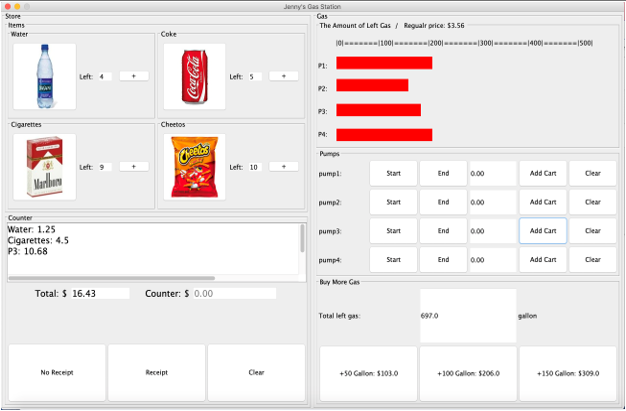
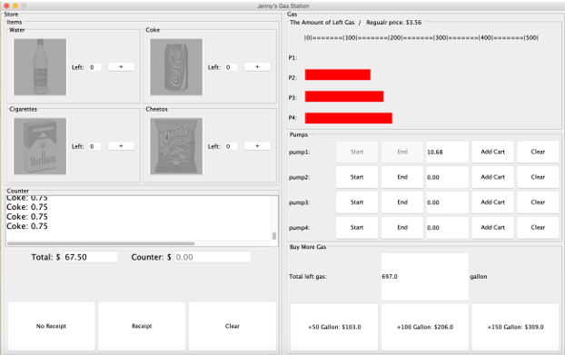

<h1 align="center">Gas Station</h1>

<!-- TABLE OF CONTENTS -->

  
Table of Contents

  <ol>
    <li><a href="#project-description">Project Description</a></li>
    <li><a href="#contribution">Contribution</a></li>
    <li><a href="#contact">Contact</a></li>
  </ol>

  
  
  
## Project Description 

The goal of this project is to make a simulation that enables to sell items/gas in the store and earn money from the customers. This simulation contains the concepts of loops, functions, lists, files, exception handling, dictionaries, and classes. 

### Purpose
 The program has three parts: Items, Cart, Coutner, Gas
		- Items: Showing all the items in the store with the amount of its stock, by clicking the image, user can have them in the cart.
		- Cart: Listing selected items with details and total costs. There are three options whether to get a receipt or not and clear the cart.
		- Counter: Listing information about selling. The money earned from selling items/gas will goes into the counter money. 
		- Gas: Showing red bars which is the about of left Gas in the gas station. User choose pumps and clicked the start button, the bar has been decreasing by time goes and also money goes high. 
	 

<h2 align="center">Links</h2>

Write up documentation: [here](resource/writeup.doc)

<h2 align="center">Contribution</h2>

Contributions are what make the open source community such an amazing place to learn, inspire, and create. Any contributions you make are **greatly appreciated**.

1. Fork the Project
2. Create your Feature Branch (`git checkout -b feature/AmazingFeature`)
3. Commit your Changes (`git commit -m 'Add some AmazingFeature'`)
4. Push to the Branch (`git push origin feature/AmazingFeature`)
5. Open a Pull Request

<h2 align="center">Contact</h2>

Jieun Lee 
 

